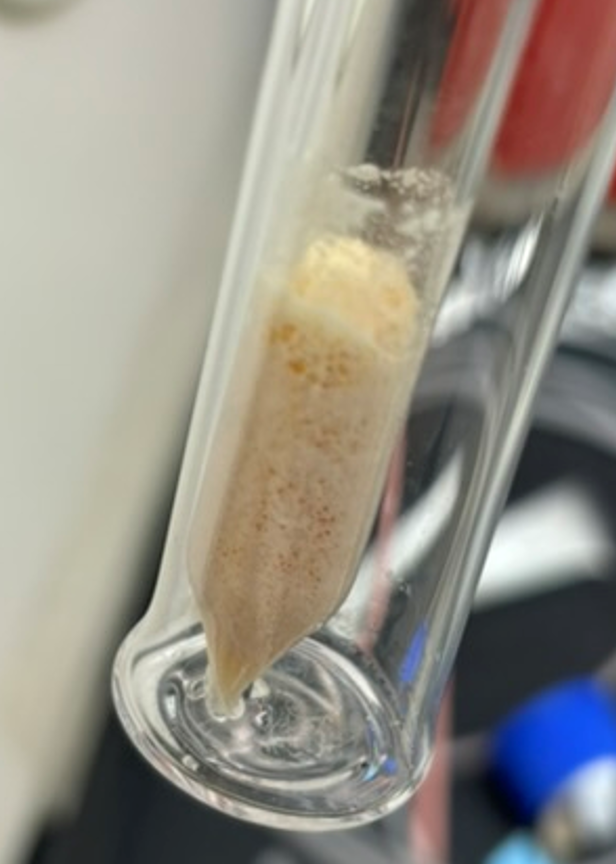

# Separation-of-terbium-from-proton-irradiated-gadolinium-oxide-targets

  
  &nbsp;&nbsp;&nbsp;&nbsp;
  

**This work is supported in part by the Horizon-broadening Isotope Production Pipeline Opportunities (HIPPO) program, under GrantDE-SC0022550 from the Department of Energy's Isotope R&D and Production Program.
**

## Overview
This repository accompanies the project detailed in **_Separation of terbium from proton-irradiated gadolinium oxide targets – development of an effective, scalable and automatable process_ (Applied Radiation and Isotopes, 2025)** — see [https://doi.org/10.1016/j.apradiso.2025.112138](https://doi.org/10.1016/j.apradiso.2025.112138).
 The included Python scripts were used to (i) calculate expected yields from proton irradiations of natGd₂O₃ targets, (ii) perform efficiency calibarion of a High Purity Germanium (HPGe) spectrometer, and (iii) automate the analysis of serial HPGe measurments. In addition to computational work, the first version of the "**Terbinator**", a remote-controlled valve and pump module, was built to semi-automate multi-column extraction chromatographic serpations for ¹⁵⁵Tb. 

All code developed for this project has been consolidated into a single Python library, **nuclab**, which will continue to be developed into a comprehensive package desinged for applications in nuclear physics, nulcear chemistry, radiochemicstry, and machine learning challenges in radiopharmaceutical development. Source code and tutorials for **nuclab** are provided in this repostiory. Representative example outputs are shown below.

<table>
  <tr>
    <th colspan="2" style="text-align:center">Example outputs of the <code>nuclab</code> Python package</th>
  </tr>
  <tr>
    <td align="center"></td>
    <td align="center"></td>
  </tr>
  <tr>
    <td align="center"><em>Fitted efficiency curve for HPGe detector using the <code>Calibration</code> class</em></td>
    <td align="center"><em>Exponential decay of ¹⁵⁴ᵐ¹Tb derived from serial HPGe spectra using the <code>Serial</code> class</em></td>
  </tr>
  <tr>
    <td align="center">
      <a href="example_outputs/efficiency_peak_data.csv">Peak fit data + per-line efficiency values (CSV)</a> · 
      <a href="example_outputs/calibration-results.xlsx">Efficiency fit parameters + fractional uncertainty (XLSX)</a>
    </td>
    <td align="center">
      <a href="example_outputs/per-line-peak-data.xlsx">Serial peak fit results (XLSX)</a> · 
      <a href="example_outputs/decay-analysis-results.xlsx">Decay analysis results (XLSX)</a>
    </td>
  </tr>
</table>

 <td align="center"><em>Per-slice isotope activities & totals using the <code>Yield</code> class</em></td>
 <a href="example_outputs/theoretical-yield-results.xlsx">Theoretical yield results (XLSX)</a>

## Design Limitations
1. There are currently no warning messages if required class attributes arent filled before calling the functions, Instead the output will simply be incomplete.

A detailed description with links of the contents of the repository are listed in the Table of Contents below.

## Table of Contents
- [Repository Contents](#repository-contents)
- [Setup Instructions](#setup-instructions)
- [Theory](#theory)
  - [Radiation Production](#radiation-production)
  - [γ-Decay](#γ-decay)
  - [Radiation Detection](#radiation-detection)
  - [Radiochemistry Concepts](#radiochemistry-concepts)
  - [Activation-Analysis](#activation-analysis)
  - [Nuclear Medicine](#nuclear-medicine)
- [References](#references)
- [Acknoledgements](acknowledgments)
## Repository Contents

### Source Files
- **`src/`** – Contains the core Python implementation of **nuclab**. Each file defines a module within the package.
  - **`production.py`** – Implements the `Yield` class. Calculates theoretical end-of-bombardment (EoB) activity yields for accelerator produced radionuclides.
  - **`calibration.py`** – Implements the `Calibration` class. Streamlines workflows for HPGe detector absolute efficiency calibration.
  - **`serial.py`** – Implements the `Serial` class. Provides a pipeline for automated analysis of serial γ-spectra measurements saved in `.Spe` format.
  - **`utils.py`** – A collection of utility functions used internally by `production.py`, `calibration.py`, and `serial.py`.

### Workflow Tutorials
- **`workflows/`** – Contains interactive **Google Colab** Juypter notebooks demonstrating how to use each core class:
  - **`calibration_to_serial_workflow.ipynb`**  Demonstrates how to combine the `Calibration` and `Serial` classes to perform detector absolute efficiency calibration and analysis of serial HPGe measurements.
  - **`yield_workflow.ipynb`** Demonstrates how to use the `Yield` class to calculate theoretical end-of-bombardment (EoB) activity values.

### Data Acquisition
- **`serial_data_acquisition/`** – Example JOB files for automated HPGe spectrum collection using MAESTRO (Windows v7.01, ORTEC®).
  - A description of the required file naming convention and examples of acceptable file names  
  - Includes example JOB files with compatible file naming conventions for automated spectrum recording.

## Introduction

### Radiation Production
Consider a large number **N** of identical radioactive atoms. We define **λ** as the total radioactive decay constant, which has dimensions of reciprocal time (typically s⁻¹).  

The product of λ and a time interval *t* (in consistent units) gives the probability that an individual atom will decay during that interval, valid for time intervals **≪ 1/λ**. We make the well-established assumption that λ is independent of the age of the atom and of all physical and chemical conditions such as temperature, pressure, concentration, etc.

The expectation value of the total number of atoms in the group that disintegrate per unit time, for intervals very short compared to **1/λ**, is called the **activity** of the group:

  

This has units of inverse time, since **N** is a dimensionless number.  

So long as the original group is not replenished by additional nuclei, the rate of change in **N** at any time *t* is equal to the activity:

  

**Stable nuclei may be transformed into radioactive species by bombardment with suitable particles, or photons at sufficiently high energy. Many radioactive isotopes with desirable properties are either absent in narture or diffucult to obtain, yet they can be produced. That is to say, there are spontaneously decaying radisotopes, that readily undergo nuclear reactions without an input of energy (nuclear decay reaction). In addition, stable or radioactive isotopes can undergo induced nuclear reactions (nuclear transmutation reaction) where the nucleus reacts with subatomic particles or photons to form a compound nucleus that is more massive than the starting material (Where the "induced" kinetic energy and rest mass energy of the particles is where this extra mass comes from). The compund nucleus formed by the addition of this mass is unstable and decays rapidly to the another isotope emitting some kind of radiation. The produced isotope may in addition spontaneosly decay.**

The purpose of an accelerator of charged particles is to direct against a target a beam of a specific kind of particles of a chosen energy. Low energy accelerators are used to produce beams in the 10-100-MeV range, often for reaction or scattering studies to elucidate the structure of specific final states, perhaps even individual excited states. These accelerators should have accurate energy selection and reasonably high currents because the ultimate precision of many expirments is limited by counting statistics.

For **charged particle induced nuclear reactions** (as done in a cyclotron), the expected activity produced in an irradiation is given by the production equation:

  

where:  
- **A(t)** – activity produced (Bq)  
- **λ** – decay constant (s⁻¹)  
- **tirrad** – irradiation length (s)  
- **σ** – reaction cross section (cm²)  
- **N₀** – atomic areal density of target material (atoms/cm²)  
  - Determined from *target mass, density, thickness, and molecular weight*  
- **I** – projectile intensity (particles/s)  
  - Calculated from the beam current (µA) using the charge per particle and the conversion factor 6.24 × 10¹⁸ charges/coulomb  

This equation holds for _thin targets_, where the energy degredation of the ion beam throughout the thickness of the target material is << 1.0%.

γ-Decay
---

Activity is defined as the number of nuclear decays per unit time (1 Bq = 1 decay/second). Pulse-mode detectors are instruments designed to register each individual quantum of radiation interacting with the detector. A spectrometer is a specialized type of pulse-mode detector that also measures the energy of each quantum, producing a radiation energy spectrum as its output. To determine the activity of a multi-radionuclide sample, a spectrometer can be used to measure the net counts within energy peaks associated with specific radionuclides, from which the corresponding activities can be calculated.

  
   
  <em>Example HPGe gamma spectrum with fitted peaks.</em>

Most nuclear reactions leave the final nucleus in an excited state. These excited states decay rapidly to the ground through through the emission of one or more γ-rays. The energy of the γ-rays is charecteristic of the energy difference between nuclear states. 

Consider the decay of a nucleus of mass M at rest from an intial excited state Eᵢ to a final state E𝒻.

To conserve linear momentum, the final nucleus will not be at rest but must have a recoil momentum pR and corresponding recoil kinetic energy TR, which we assume to be nonrelativistic.

  

Conservation of total energy and momentum give,

   
  

The nucleus recoils with momentum equal and opposite to that of the gamma ray.

Defining,

  

And using relative relationship,

  

  

Which has the solution,

  

The energy differences of the nucleus are typically of the order of MeV, while the rest energies are of order A×10³ eV, where A is the mass number.

  

To a precision of the order 10⁻⁴ to 10⁻⁵ we keep only the first three terms in the expansion of the square root.

  

The actual γ-ray energy is thus diminished somewhat from the maximum available decay energy. Recoil correction to the energy is generally cosidered negligible amounting to a 10⁻⁵ correction that is usually far smaller than expeiremental uncerainty. The Mossbauer effect is one circumstance in which recoil plays an important role.

In this work we assume,

  

For low energy γ-rays, recoil energy is less than 1 eV and has negligible effect. High-energy γ-rays (5–10 MeV radiation emitted following neutron capture) gives recoils in the range of 100 eV, which may be sufficient to drive the recoiling atom from its position in a solid lattice ("radiation damage").

Radiation Detection
---
Uncharged radiations such as gamma rays or neutrons must first undergo interaction in the detector before detection is possible. Because these radiations can travel large distances between interactions, detectors are often less that 100% efficient. A precise determination of the detector efficiency is therefore required to relate the number of pulses recorded to the number of neutrons or gamma rays emitted by the source. 

For a given γ-peak in the spectrum, the observed counts can be expressed as:

  

where:  
- **decays** – the total number of nuclear decays in the sample for the radionuclide emitting the γ-line  
- **Iγ** – the emission probability that the radionuclide decay produces the specific γ-ray of interest  
- **ϵabs** – the absolute detector efficiency at the γ-ray energy of interest  

The **nuclab** `Calibration` class is used to determine absolute detector efficiencies. These depend not only on intrinsic detector properties but also on the experimental counting geometry. For our purposes, we define the absolute efficiency is defined as:

  

Over the course of a measurement, the activity of a radioactive source decreases exponentially:

  

To obtain the total number of decays during a measurement, the activity curve is integrated over time (*units check: Bq × s = decays/s × s = decays*):

  

For the special case where the measurement starts at *t₁ = 0*:

  

Relating the number of decays to the recorded counts gives:

  

Solving for the initial activity *A₀* (i.e., the activity at the start of the measurement):

  

This formulation is important because it accounts for the decay of radioactive material during the measurement interval. In contrast, the general counts relation:

  

does not incorporate the time-dependent decrease in activity.

Activation Analysis
---

Activation analysis (AA) is an analytical technique that allows one to determine the amount of a given element X contained in some material Y. The basic steps in the activation technique are as follows:

- Irradiate Y with a source of ionizing radiation so that some generally very small amount of X will change into X*, a radioactive isotope of X.
- Using chemical or instrumental technqiues, "isolate" X and X* from all other elements in Y (not necessarily quantitatively) and measure the activity of X*.
- Calculate the amount of X present.

But how does one calculate the amount of X present, knowing the activity of X* produced in the irradiation? Since the radioactivity was produced in a nuclear reaction, it can be shown that the activity AX* as a function of time is 

  

Where NX is the number of X nuclei present initially, ti is the length of the irradiation, and td is the time of decay after the end of an irradiation. From this equation one can calculate NX from AX*. This equation for AX* is only valid for “thin targets,” that is, samples that absorb less than 5% of the flux of activating particles.

This method of analysis is called absolute activation analysis and is rarley done. The reasons for this are the need for detailed knowledge of the flux and energy of the bombarding particles in the sample and the compound of the nuclear unceratinties such as the cross sections, decay branching ratios, and so on in the final results. A simpler technique is to irradiate and count a known amount of pure X under the same conditions used for the mixute of X in Y. Then,

Mass of X in Y = (Known mass X)(Acitivty of X* in Y / Activity of X* in pure X)

Which is known as the comparator technqiue and is the most widely used method of AA. The method only depends on irrdiating and counting standards known amounts of pure material using the same conditions as the samples being analyzed.

Numerous tests have shown that with careful experimental manipuation, AA is an accurate (~1% accuracy) and precise (~5% precision) method of measuring elemental concentrations.

#### Methods

We cailibrate an HPGe detector by using calibration sources of a very well defined activity. Because we know the activity we may clearly establish the number of decays of each source for a given measurment time. We know that for each decay there are certain gammas that are emitted in a charecterized probablistic manner (# emissions of certain energy / # decays of certain isotopes), therefore we can clearly establish the number of gammas of certain energies that should be emitted by the calibration sources (especially for long measuremnt times). A fraction of the gammas truly emitted by the calibration sources are detected. Additionally coincidence summing may occur. Although coincendence summing was minimized by placing the sample 200cm from the face of the detector, coincidence summing may reduce the observed number of counts detected at certain peak energies, reducing the determined activities if those gammas are being analyzed. Each of these effects is incorporated into a single detector efficiency metric by simply measuring a known number of gammas across the energy spectrum for 24hr, looking at the number of counts detected at each energy, and taking the ratio of those number. This value is energy dependent so a function, whose form is a mystery to me, is fit to the data (CPS/Bq = # of counts detected in time interval / measurment time / # known number of decays in time interval).

We then detect the number of counts across the energy spectrum of a natGd2O3 sample that had been irradiated at 12.6 MeV for 30mins in a low-energy cyclotron tailored for 18F production, producing many radioactive terbium isotopes. Once again, knowing certain gammas are emitted in a charecterized probablistic manner by the Tb isotopes, we can determine the activity of each that had been produced in the irradition, by using the previously determined detector efficiencies at the know Tb gamma energies. We repeat this process at 2h intervals ~10hr post irradiation, correcting for sample decay during the measurment. We fit an exponential decay function to the measured activites across the serial measurments floating the end-of-bombardment (eob) activity and half-lifes of the Tb isotpes using the ``Serial`` class. Additionally we decay correct the start of measurment activites determined each measurment to eob and take the average.

156Tb has 2 metastable states that grow into the ground state with ~24hr and ~5hr have lives. In addition to the 2hr measurments, repeated 5 and 10 minute interval measurments were recorded ~1hr post eob. Adding this data to the decay analysis of 156Tb allowed us to see the growth in of the metastable states to the ground state. We fit the bateman equation to the decay to determine eob activities and half-lives for each of the isomers. We attempted to repeat this process to charecterize the isomers of 154Tb, but the growth in was observed to be neglible.

We compare the expirmentally determined activities to expected yields calculated using the production equation. To account for charged particle attenuation in the target material, we decomposed the target material into thin slices of 1 keV using stopping power values from SRIM. This allows us to have a beter estimatation of the proton beam energy at different thicknesses within the target material, enabling per slice energy dependent cross sections to be used. The total activity is simply the sum of the activites produced in each slice.

## References

- Glenn F. Knoll. Radiation Detection and Measurement. 4th edition, Wiley, 2010 (ISBN
978-0-470-13148-0)

- Frank Herb Attix. Introduction to Radiological Physics and Dosimetry, John Wiley & Sons,
Inc. 1986 or reprinted in 2004 Wiley VCH

- Loveland, W. D., Morrissey, D. J., & Seaborg, G. T. (2017). Modern nuclear chemistry. https://doi.org/10.1002/9781119348450

- Krane, K. S., & Lynch, W. G. (1989). Introductory Nuclear Physics. Physics Today, 42(1), 78. https://doi.org/10.1063/1.2810884

- Holiski, Connor K., et al. “Adsorption of terbium (III) on DGA and LN resins: Thermodynamics, isotherms, and kinetics.”
Journal of Chromatography A, vol. 1732, 2024, article no. 465211. https://doi.org/10.1016/j.chroma.2024.465211.

- Poole, C F, and Elsevier (Amsterdam. The Essence of Chromatography. Amsterdam, Elsevier, 2010.

## Useful Links

- [Packaging Python Projects (official tutorial)](https://packaging.python.org/en/latest/tutorials/packaging-projects/)

``But I'm not a rapper``

``You know what I mean?``

## Gd2O3 Recycling and The Failed Proton Activation Analysis

The 5- and 10-minute interval measurments taken ~1hr post eob described above were intially taken with the intention of assessing the elemental composition of natGd2O3 recyled through the process described in the accompaying paper.

After going through through the radiochemical seperation process, ~95% of the Gd is recovered in the first 4 rinse fractions (~40mL 0.2M HNO3) of the first LN2 column. The fractions are dried down, leaving behind Gd(NO3)3 * XH2O salf. In the recovery process, across the temperature gradient (time) of the process, the composition of Gd(NO3)3 takes place through the following scheme shown in _Non-isothermal kinetics of the thermal decomposition of gadolinium nitrate._

  

  

  

It was confirmed by XRD that a ramping rate of 2C/min allowed for a complete denitration process, however when starting the ramping from 180C we observed some gadolinum nitrate still present in the final product.

<table>
  <tr>
    <td align="center"></td>
    <td align="center"></td>
  </tr>
</table>

  <em>
    Initial failed recycling that did not dissolve – likely was not Gdx(NO3)x (p35).  
    Failed dissolution w/ heat gun, later dissolved more so in conc. HNO₃ (p36).  
    Denitrated with some flaky white precipitate; had insoluble grey, then white flakes after GL32 drying.  
    Flakes and powder stuck to quartz tube very high up. – Furnace set from 180 °C to 600 °C but at a fast ramp rate of 16 °C/min.
  </em>

Additional comments from failed recycling processes:

6/19/2024 Recycling description: "furnace pushed from 180C to 400C to 600C. Done on two separate days (p33 and 37) due to yellowish color of powder."

10/10/2024 Recyling description: "SLOW RAMP (2C/min from 180-600C, then 2 hours at 600C)"

However numerous tests have shown that with careful experimental manipuation, AA is an accurate (~1% accuracy) and precise (~5% precision) method of measuring elemental concentrations. We attempted to quantify the number of 14N atoms remaining in the recycled natGd2O3, by measuring the 11C activity that is created in the 14N(p, alpha)11C reaction

 We attempted to quantify the number of 14N (99.579% nat. abundance) atoms in a target made from recycled materials, by measuring the amount of 11C that was created in the 14N(p, alpha)11C reaction. Complications in this procedure immediatley rise from the short-half life of 11C (~20 mins) and the fact that its only gamma emission is a 511 keV peak which contains lots of background. To further complicate the process The oxygen present in both gadolinium oxide and the various nitrate compounds undergoes the 16O(p, alpha)13N reaction to create another short-lived (~10 min), only 511 keV peak emitting radiosoptes. And once again to further complicate this process, 152Tb, 153Tb, 154Tb, 156Tb, and 158Tb are all B+ emitting radionuclides that were created in the irradiation.

The irrdidiations were conducted with the intent of creating tracer-scale amounts of Tb to use in the isolation expeiriments. Immediatley post eob the activity from the target was measured to be somewhere ~10 mCi. This level of activity lead to deadtimes greater than 10% at the maximum possible distance from the face of the hpge detector until ~45mins (~2x half-lives, ~4.5 half-lives of the isotopes respectivley) leading to a lack of statistics for the curve fitting to near eob to fit inital activities. In a "crude" attempt to quantify the results of the 5- and 10-min serial measurements we fit a sum of exponentials to 511 keV peak activity (using an average of the 11C and 11N 551 keV emission intensity) accross the measurements. We dont take into account any of the producued Tb isotopes. 

The atomic areal densities of 14N and 16O in the sample was determined to be 5.4x10^19 atoms/cm2 and 1.8e20 atoms/cm2 respectivley. We have a total pocket radius of 5cm giving 4.2x10^19 14N atoms and 1.4x10^20 16O atoms respectivley. 

Total number O = O from Gd2O3 + O from nitrates

Total number 0 - total number O * 

## Things I wanted to add but cba
- Interaction of Radiaion w/ Matter
  - Quantities for Describing The Interaction of Ionizing Radiation w/ Matter.
  - Exponential Attenuation
  - Gamma- and X-Ray Interactions in Matter
  - Charged Particle Interactions in Matter
- General Detector Properties
- ionizing radation chapter attix, charged particle equilibirum, 
- Lack of enriched 160Gd, implications for 161Tb production
- counting statstics

  
Some fraction of the incoming particle energy is imparted to the kinetic energy of
the compound nucleus to achieve conservation of momentum.

How is 161Tb an Auger emitter if it decays by B- 100% of the time to a stable isotope? approximately eleven Auger electrons (where did that come from?)

No carrier added?

Is coulomb barrier included in the threshold energy? or is the threshold energy stricly in terms of inducing a nuclear change post getting past the coulomb barrier?

The incident particle has many collisions inside the nucleus, depositing its energy to many
nucleons and becoming indistinguishable from them. This results in a highly excited
“compound nucleus” that can then “de-excite” in a process totally decoupled from the
incident event.

Deuterium-Tritium fission reactions

## Acknowledgments

I would first like to thank **Justin Peikin** who built this project from the ground up. The work in **_Separation of terbium from proton-irradiated gadolinium oxide targets – development of an effective, scalable and automatable process_ (Applied Radiation and Isotopes, 2025)** — see [https://doi.org/10.1016/j.apradiso.2025.112138](https://doi.org/10.1016/j.apradiso.2025.112138) can be largely attributed to his dedication to the project and foundational work.

I am also grateful to **Taylor Johnson** who built the control box of the **Terbinator**.

In addition, I would like to thank Dr. Jonathan Morrell, creator of the CURIE python package, for his constructive feedback on the _CURIE Toolkit Gamma Spectroscopy Peak Fitting Methods_ supplementary material section.

The Irrations were peformed carried out by the **Cyclotron Gang** at UW-Madison under the supervision of **Dr. Todd Barnhart** and **Dr. John Engle**.

Finally, I am thankful Dr. Ellison who encouraged me to explore the addtional topics presented in this repository.

**This work is supported in part by the Horizon-broadening Isotope Production Pipeline Opportunities (HIPPO) program, under GrantDE-SC0022550 from the Department of Energy's Isotope R&D and Production Program.
**
