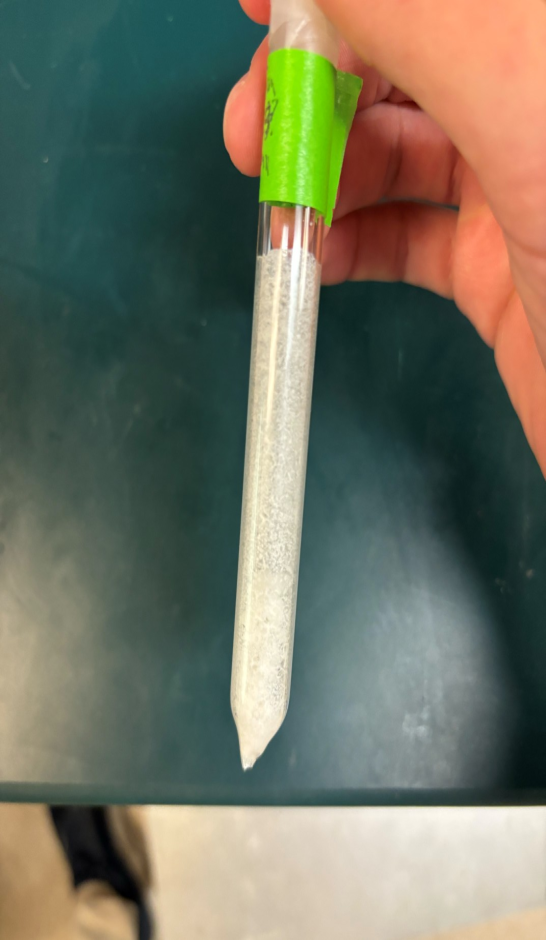
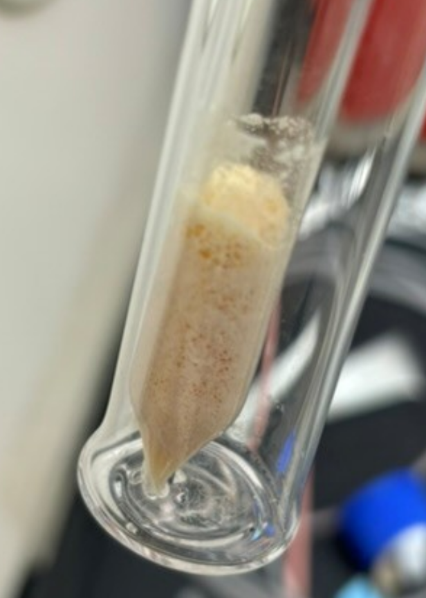

# Separation-of-terbium-from-proton-irradiated-gadolinium-oxide-targets

<p align="center">
  
  &nbsp;&nbsp;&nbsp;&nbsp;
  
</p>


**This work is supported in part by the Horizon-broadening Isotope Production Pipeline Opportunities (HIPPO) program, under GrantDE-SC0022550 from the Department of Energy's Isotope R&D and Production Program.
**

## Overview
This repository accompanies the project detailed in **_Separation of terbium from proton-irradiated gadolinium oxide targets – development of an effective, scalable and automatable process_ (Applied Radiation and Isotopes, 2025)** — see [https://doi.org/10.1016/j.apradiso.2025.112138](https://doi.org/10.1016/j.apradiso.2025.112138).
 The included Python scripts were used to (i) calculate expected yields from proton irradiations of natGd₂O₃ targets, (ii) perform efficiency calibarion of a High Purity Germanium (HPGe) spectrometer, and (iii) automate the analysis of serial HPGe measurments. In addition to computational work, the first version of the "**Terbinator**", a remote-controlled valve and pump module, was built to semi-automate multi-column extraction chromatographic serpations for ¹⁵⁵Tb. 

All code developed for this project has been consolidated into a single Python library, **nuclab**, which will continue to be developed into a comprehensive package desinged for applications in nuclear physics, nulcear chemistry, radiochemicstry, and machine learning challenges in radiopharmaceutical development. Source code and tutorials for **nuclab** are provided in this repostiory. Representative example outputs are shown below.

<table>
  <tr>
    <th colspan="2" style="text-align:center">Example outputs of the <code>nuclab</code> Python package</th>
  </tr>
  <tr>
    <td align="center"></td>
    <td align="center"></td>
  </tr>
  <tr>
    <td align="center"><em>Fitted efficiency curve for HPGe detector using the <code>Calibration</code> class</em></td>
    <td align="center"><em>Exponential decay of ¹⁵⁴ᵐ¹Tb derived from serial HPGe spectra using the <code>Serial</code> class</em></td>
  </tr>
  <tr>
    <td align="center">
      <a href="example_outputs/efficiency_peak_data.csv">Peak fit data + per-line efficiency values (CSV)</a> · 
      <a href="example_outputs/calibration-results.xlsx">Efficiency fit parameters + fractional uncertainty (XLSX)</a>
    </td>
    <td align="center">
      <a href="example_outputs/per-line-peak-data.xlsx">Serial peak fit results (XLSX)</a> · 
      <a href="example_outputs/decay-analysis-results.xlsx">Decay analysis results (XLSX)</a>
    </td>
  </tr>
</table>

<p align="center">
 <td align="center"><em>Per-slice isotope activities & totals using the <code>Yield</code> class</em></td>
 <a href="example_outputs/theoretical-yield-results.xlsx">Theoretical yield results (XLSX)</a>
</p>


A detailed description with links of the contents of the repository are listed in the Table of Contents below.

## Table of Contents
- [Repository Contents](#repository-contents)
- [Setup Instructions](#setup-instructions)
- [Theory](#theory)
  - [Radiation Production](#radiation-production)
  - [γ-Decay](#γ-decay)
  - [Radiation Detection](#radiation-detection)
  - [Radiochemistry Concepts](#radiochemistry-concepts)
  - [Activation-Analysis](#activation-analysis)
  - [Nuclear Medicine](#nuclear-medicine)
- [References](#references)
- [Acknoledgements](acknowledgments)
## Repository Contents

### Source Files
- **`src/`** – Contains the core Python implementation of **nuclab**. Each file defines a module within the package.
  - **`production.py`** – Implements the `Yield` class. Calculates theoretical end-of-bombardment (EoB) activity yields for accelerator produced radionuclides.
  - **`calibration.py`** – Implements the `Calibration` class. Streamlines workflows for HPGe detector absolute efficiency calibration.
  - **`serial.py`** – Implements the `Serial` class. Provides a pipeline for automated analysis of serial γ-spectra measurements saved in `.Spe` format.
  - **`utils.py`** – A collection of utility functions used internally by `production.py`, `calibration.py`, and `serial.py`.

### Workflow Tutorials
- **`workflows/`** – Contains interactive **Google Colab** Juypter notebooks demonstrating how to use each core class:
  - **`calibration_to_serial_workflow.ipynb`** [](https://colab.research.google.com/github/vivektara24/Separation-of-terbium-from-proton-irradiated-gadolinium-oxide-targets/blob/main/workflows/calibration_to_serial_workflow.ipynb) Demonstrates how to combine the `Calibration` and `Serial` classes to perform detector absolute efficiency calibration and analysis of serial HPGe measurements.
  - **`yield_workflow.ipynb`**[](https://colab.research.google.com/github/vivektara24/Separation-of-terbium-from-proton-irradiated-gadolinium-oxide-targets/blob/main/workflows/yield_workflow.ipynb) Demonstrates how to use the `Yield` class to calculate theoretical end-of-bombardment (EoB) activity values.

### Data Acquisition
- **`serial_data_acquisition/`** – Example JOB files for automated HPGe spectrum collection using MAESTRO (Windows v7.01, ORTEC®).
  - A description of the required file naming convention and examples of acceptable file names  
  - Includes example JOB files with compatible file naming conventions for automated spectrum recording.

## Setup Instructions

You have three options for using the libname package:

- **Option 1: Pip Install (recommended)**  
  *(Coming soon, once available on PyPI)*
  ```bash
  pip install <package-name>
  ```
- **Option 2: Clone the Repository**  

```bash
git clone https://github.com/vivektara24/Separation-of-terbium-from-proton-irradiated-gadolinium-oxide-targets.git
cd Separation-of-terbium-from-proton-irradiated-gadolinium-oxide-targets
```

If you only need specfic files (e.g, `serial.py`, `utils.py`), you can fetch them directly with `wget` / `curl`:
```bash
wget https://raw.githubusercontent.com/vivektara24/Separation-of-terbium-from-proton-irradiated-gadolinium-oxide-targets/main/src/serial.py
wget https://raw.githubusercontent.com/vivektara24/Separation-of-terbium-from-proton-irradiated-gadolinium-oxide-targets/main/src/utils.py
```

- **Option 3: Download as ZIP (no git required)**  
1. Navigate to this repository's main page on GitHub
2. Click the green **Code** button → **Download ZIP**.
3. Unzip it on your computer.

#### Step 2. Install Dependencies
Install the required Python libraries using the provided `requirements.txt`:
```bash
pip install -r requirements.txt
```

#### Step 3. Run the Example
Try the tutorial in `example.py` to verify your installation.
```python
python example.py
```

## Theory

### Radiation Production
Consider a large number **N** of identical radioactive atoms. We define **λ** as the total radioactive decay constant, which has dimensions of reciprocal time (typically s⁻¹).  

The product of λ and a time interval *t* (in consistent units) gives the probability that an individual atom will decay during that interval, valid for time intervals **≪ 1/λ**. We make the well-established assumption that λ is independent of the age of the atom and of all physical and chemical conditions such as temperature, pressure, concentration, etc.

The expectation value of the total number of atoms in the group that disintegrate per unit time, for intervals very short compared to **1/λ**, is called the **activity** of the group:

<p align="center">
  
</p>

This has units of inverse time, since **N** is a dimensionless number.  

So long as the original group is not replenished by additional nuclei, the rate of change in **N** at any time *t* is equal to the activity:

<p align="center">
  
</p>


The old unit of activity was the **curie (Ci)**, originally defined as the number of disintegrations per second occurring in a mass of 1 g of ²²⁶₈₈Ra.  
Later the definition was divorced from the radium standard and fixed to:

<p align="center">
  
</p>

(1 g of ²²⁶Ra has an activity of 0.988 Ci).  

More recently, the SI unit **becquerel (Bq)** was adopted, defined as:

<p align="center">
  
</p>

Conversions between the traditional curie (Ci) and the SI base unit (Bq) are shown below:

<p align="center">
  <b>1 Ci</b> = 3.7 × 10¹⁰ Bq<br/>
  <b>1 mCi</b> = 3.7 × 10⁷ Bq<br/>
  <b>1 µCi</b> = 3.7 × 10⁴ Bq
</p>


**Stable nuclei may be transformed into radioactive species by bombardment with suitable particles, or photons at sufficiently high energy. Many radioactive isotopes with desirable properties are either absent in narture or diffucult to obtain, yet they can be produced. That is to say, there are spontaneously decaying radisotopes, that readily undergo nuclear reactions without an input of energy (nuclear decay reaction). In addition, stable or radioactive isotopes can undergo induced nuclear reactions (nuclear transmutation reaction) where the nucleus reacts with subatomic particles or photons to form a compound nucleus that is more massive than the starting material (Where the "induced" kinetic energy and rest mass energy of the particles is where this extra mass comes from). The compund nucleus formed by the addition of this mass is unstable and decays rapidly to the another isotope emitting some kind of radiation. The produced isotope may in addition spontaneosly decay.**


For an efficient and effective disucussion of nuclear reactions, we must understand the notation or jargon that is widely used to describe them. Let us begin by considering one of the first nuclear reactions to be studied in 1919 by Ernest Rutherford:

⁴He + ¹⁴N → ¹⁷O + ¹H + Q

Here an alpha particle emitted by radium reacts with a nitrogen nucleus-producing oxygen, a proton, and some energy, Q. Most nuclear reactions are studied by inducing a collision between two nuclei where the heavier reacting nucleus is at rest (the ``target`` nucleus) while the other nucleus (the ``projectile`` nucleus) is in motion, and this is called "normal kinematics". Such nuclear reactions might be described generally as:

Projectile (P) + Target (T) → Emitted Particle(s) (X) + Residual Nucleus (R) + Energy

A shorthand way to denote such reactions is, for the general case:

T(P, x)R

For the specific example discussed earlier:

¹⁴N(⁴He, p)¹⁷O

In a nuclear reaction moderated by the strong force in contrast to the weak force, there is conservation of the number of proton and neutrons (and thus the number of nucleons). There is also conservation of energy, momentum, angular momentum, and parity.

Consider the T(P, x)R reaction with only two products. Neglecting electron binding energies, we have, for the energy balance in the reaction,

<p align="center">
  
</p>

Note that since R and x may be complex nuclei, they could be formed in excited states so that the values of m may be different than the ground state masses. The Q value of the reaction is defined as the difference in mass energies of the products and reactants, that is,

<p align="center">
  
</p>

Note that if Q is positive the reaction is exoergic, while if Q is negative, the reaction is endoergic. Note that a necessary but not sufficient condition for the occurrence of a nuclear reaction is that

<p align="center">
  0" />
</p>

i.e for an endoergic process the decrease in the mass energies from reactants to products must be compensated for by the kinetic energy of the projectile.

If the masses of both the products and reactants are known, the Q-value can be calculated using mass excesses as

<p align="center">
  
</p>

If there are only two products in a so-called-two body reaction, we can show using conservation of momentum, that only  and the angle  of particle x with repsect to the direction of motion of P suffice to determine Q. The proof is rather long so I leave you the final result, the _Q-value equation_:

<p align="center">
  
</p>

What does the Q-value equation say? Is says that if we measure the kinetic energy of the emitted particle x and angle at which it is emitted in a two-body reaction and we know the identities of the reactants and products of the reactions, that we can determine the Q value of the reaction. In short, we can measure the energy release for any two-body reaction by measuring the properties of one of the products.

For additional insight, let us now consider the same reaction as described in the center of mass (CM) reference frame. In the CM system the total momentum of the particles is zero, before and after the collision. The kinetic energy carried in by the projectile, , is not fully available to be dissipated in the reaction, an amount, , must be carried away by the motion of the CM. 

Thus, the available energy to be used (dissipated) in the collision is only 

<p align="center">
  
</p>. 

The energy available for the nuclear reaction is 

<p align="center">
  
</p>. 

To make an endothermic reaction go, the sum  must satisfy 

<p align="center">
  
</p>. 

Rearranging a few terms in the equation, the condition for having the reaction occur is that

<p align="center">
  
</p>

This minimum kinetic energy that the projectile must have to make the reaction go forward is called the threshold energy for the reaction.


The purpose of an accelerator of charged particles is to direct against a target a beam of a specific kind of particles of a chosen energy. Low energy accelerators are used to produce beams in the 10-100-MeV range, often for reaction or scattering studies to elucidate the structure of specific final states, perhaps even individual excited states. These accelerators should have accurate energy selection and reasonably high currents because the ultimate precision of many expirments is limited by counting statistics.

A [cyclotron](https://www.youtube.com/watch?v=cutKuFxeXmQ) is one type of particle accelerator. It is a circular device in which a beam of particles makes many (often hundreds) of revolutions, receiving a small voltage increment on each orbit until the particles reach energies in the MeV range. The earliest and simplest of these accelerators is the cyclotron, sometimes referred to as a magnetic resonance accelerator. The essential design idea of the cyclotron was concieved by Ernest Lawrence at the University of California Berkeley in 1929. The critical feature is that the time it takes for a particle to travel one semicircular path is independent of the radius of the path--as particles spiral to larger radii, they also gain energy and move at greater speed, and the gain in path length is exactly compensated by the increased speed. If the half-period of the AC voltage on the dees is set equal to the semicircular orbit time, then the field alternates in exact synchronization with the passage of particles through the gap, and the particle sees an accelerating voltage each time it crosses the gap.

The Lorentz force in the circular orbit, **qvB**, provides the necessary centripetal acceleration to maintain the circular motion at an instantaneous radius *r*:  

<p align="center">
  
</p>

The time necessary for a semicircular orbit is:  

<p align="center">
  
</p>

The frequency of the AC voltage is:  

<p align="center">
  
</p>

This is often called the **cyclotron frequency** or **cyclotron resonance frequency** for a particle of charge *q* and mass *m* moving in a uniform field *B*. Here, ν and B are intimately linked—for a given field strength, the frequency can only take one value for resonance.  

The velocity increases gradually as the particle spirals outward, reaching its maximum value at the largest radius *R*:  

<p align="center">
  
</p>

which leads to a maximum kinetic energy:  

<p align="center">
  
</p>

For **charged particle induced nuclear reactions** (as done in a cyclotron), the expected activity produced in an irradiation is given by the production equation:

<p align="center">
  
</p>

where:  
- **A(t)** – activity produced (Bq)  
- **λ** – decay constant (s⁻¹)  
- **t<sub>irrad</sub>** – irradiation length (s)  
- **σ** – reaction cross section (cm²)  
- **N₀** – atomic areal density of target material (atoms/cm²)  
  - Determined from *target mass, density, thickness, and molecular weight*  
- **I** – projectile intensity (particles/s)  
  - Calculated from the beam current (µA) using the charge per particle and the conversion factor 6.24 × 10¹⁸ charges/coulomb  

This equation holds for _thin targets_, where the energy degredation of the ion beam throughout the thickness of the target material is << 1.0%.

Radioactive nuclei, either natural or artificially produced by nuclear transmutation reactions, are unstable and tend to seek more stable configurations through expulsion of energetic particles, including one or more of the following,* where corresponding changes in the atomic number (Z) and number of nucleons (A) are indicated:

| Emission Type   | ΔZ  | ΔA  |
|-----------------|-----|-----|
| α-particle      | -2  | -4  |
| β⁻-particle     | +1  | 0   |
| β⁺-particle     | -1  | 0   |
| γ-ray           | 0   | 0   |

Some radionuclides decay by more than one mode.

γ-Decay
---

Activity is defined as the number of nuclear decays per unit time (1 Bq = 1 decay/second). Pulse-mode detectors are instruments designed to register each individual quantum of radiation interacting with the detector. A spectrometer is a specialized type of pulse-mode detector that also measures the energy of each quantum, producing a radiation energy spectrum as its output. To determine the activity of a multi-radionuclide sample, a spectrometer can be used to measure the net counts within energy peaks associated with specific radionuclides, from which the corresponding activities can be calculated.

<p align="center">
  
  <br/>
  <em>Example HPGe gamma spectrum with fitted peaks.</em>
</p>

Most nuclear reactions leave the final nucleus in an excited state. These excited states decay rapidly to the ground through through the emission of one or more γ-rays. The energy of the γ-rays is charecteristic of the energy difference between nuclear states. 

Consider the decay of a nucleus of mass M at rest from an intial excited state Eᵢ to a final state E𝒻.

To conserve linear momentum, the final nucleus will not be at rest but must have a recoil momentum p<sub>R</sub> and corresponding recoil kinetic energy T<sub>R</sub>, which we assume to be nonrelativistic.

<p align="center">
  
</p>

Conservation of total energy and momentum give,

<p align="center">
  <br/>
  
</p>

The nucleus recoils with momentum equal and opposite to that of the gamma ray.

Defining,

<p align="center">
  
</p>

And using relative relationship,

<p align="center">
  
</p>

<p align="center">
  
</p>

Which has the solution,

<p align="center">
  
</p>

The energy differences of the nucleus are typically of the order of MeV, while the rest energies are of order A×10³ eV, where A is the mass number.

<p align="center">
  
</p>

To a precision of the order 10⁻⁴ to 10⁻⁵ we keep only the first three terms in the expansion of the square root.

<p align="center">
  
</p>

The actual γ-ray energy is thus diminished somewhat from the maximum available decay energy. Recoil correction to the energy is generally cosidered negligible amounting to a 10⁻⁵ correction that is usually far smaller than expeiremental uncerainty. The Mossbauer effect is one circumstance in which recoil plays an important role.

In this work we assume,

<p align="center">
  
</p>

For low energy γ-rays, recoil energy is less than 1 eV and has negligible effect. High-energy γ-rays (5–10 MeV radiation emitted following neutron capture) gives recoils in the range of 100 eV, which may be sufficient to drive the recoiling atom from its position in a solid lattice ("radiation damage").

Radiation Detection
---
Uncharged radiations such as gamma rays or neutrons must first undergo interaction in the detector before detection is possible. Because these radiations can travel large distances between interactions, detectors are often less that 100% efficient. A precise determination of the detector efficiency is therefore required to relate the number of pulses recorded to the number of neutrons or gamma rays emitted by the source. 

For a given γ-peak in the spectrum, the observed counts can be expressed as:

<p align="center">
  
</p>

where:  
- **decays** – the total number of nuclear decays in the sample for the radionuclide emitting the γ-line  
- **I<sub>γ</sub>** – the emission probability that the radionuclide decay produces the specific γ-ray of interest  
- **ϵ<sub>abs</sub>** – the absolute detector efficiency at the γ-ray energy of interest  

The **nuclab** `Calibration` class is used to determine absolute detector efficiencies. These depend not only on intrinsic detector properties but also on the experimental counting geometry. For our purposes, we define the absolute efficiency is defined as:

<p align="center">
  
</p>


Over the course of a measurement, the activity of a radioactive source decreases exponentially:

<p align="center">
  
</p>

To obtain the total number of decays during a measurement, the activity curve is integrated over time (*units check: Bq × s = decays/s × s = decays*):

<p align="center">
  
</p>

For the special case where the measurement starts at *t₁ = 0*:

<p align="center">
  
</p>

Relating the number of decays to the recorded counts gives:

<p align="center">
  
</p>

Solving for the initial activity *A₀* (i.e., the activity at the start of the measurement):

<p align="center">
  
</p>

This formulation is important because it accounts for the decay of radioactive material during the measurement interval. In contrast, the general counts relation:

<p align="center">
  
</p>

does not incorporate the time-dependent decrease in activity.

Radiochemistry Concepts
---
Radiochemistry is defined as "the chemical study of radioactive elements, both natural and artificial, and their use in the study of chemical processes".

Operationally, radiochemistry is defined by the activities of radiochemists, that is,

- Nuclear analytical methods
- Applications of radionuclides in areas outside chemistry, such as medicine
- Physics and chemsitry of radioelements
- Physics and chemistry of high-activity-level matter
- Radiotracer studies

Because of the small amounts of materials involved, the presence of radioactivity, and the frequent need to deal with short-lived nuclei, these techniques are not the same as ordinary chemical techniques.

The range of activity levels in radiochemical procedures ranges from pCi to MCi. For the sake of discussion let us assume an activity level D, typical of radiotracer experiments 1uCi, and a nucleus with mass number A~100. If we assume a half-life for this radionuclide of 3 d, the number of nuclei present can be calculated from the equation,

<p align="center">
  
</p>

<p align="center">
  
</p>


<p align="center">
  
</p>

<p align="center">
  
</p>

This quanity of material, if prepared in an aqueous solution of volume 1 L, would have a concentration of 10^-14 mol/L. This simple calculation demostrates a number of important features in radiochemistry:
- The manipulation samples involving infinitesimal quantities of material
- The power of nuclear analytical techniques (since 1uCi is a significant, easily detectable quantity of radioactivity)
- The ability to do chemistry one atom at a time (an extention of the calculation, since the decay of a single atom might occur by alpha-particle emission with 100% detection efficiency)

The small number of atoms involved in some radiochemical procedures can alter the expected behavior. Although time-dependent processes obeying first-order kinetics are not changed by changes in concentration, the same is not true of second order kinetics. The extreme dilution in some solutions can mean that equilibrium is not reached due to kinetic limitations.

In addition to limitations posed by kinematics or thermodynamics, there are certain problems associated with very low solution concentrations. An important problem is the adsorption of tracer levels of radioactivity on the surfaces of laboratory glassware. Glass has an ion-exchange capacity of 10^-10 mol/cm2 along with similar number of chemisorption sites. A 100-mL beaker can absorb ~10^-8 mol, which is significant if conetration of the tracer is <= 10^-6 M.

In the study of nuclear reactions, nuclear structure, and the heaviest elements, one frequently needs to chemically seperate the nuclide(s) of interest from other radioactive species that are present. This is done by performing radiochemical separations that involve the conventional seperation techniques of analytical chemistry apdated to the special needs of radiochemistry.

Chromatography is a physical method of separation in which the components to be seperated are distributed between two phases, one of which is stationary (stationary phase), usually a powder filled tube (column), while the other (the mobile phase) moves in a definite direction.

A multi-component sample disolved in mobile phase is flowed through the column (called loading), followed by more mobile phase. Depending on the relative affinity of each component for the stationary phase versus the mobile phase, the components will come off the column (called eluting) after different volumes of mobile phase, allowing for their separation.

There are many different types of chromatographic stationary phases (often called resins) and mobile phases for many different scientific purposes. The physiochemical mechanism of sample-stationary phase interaction varies for different kinds of chromatography.

Extraction chromatography is a form of solvent extraction where one of the liquid phases is made stationary by adsorption on a solid support. The other liquid phase is mobile. Either the aqueous or the organic phase can be made stationary. Extraction chromatography has the selectivity of solvent extraction and the multistae charecter of a chromatgraphic process. It is generally used for labratory-scale experiments, although some attempts have been made to use it in larger scale operations.

The LN Series resins (LN, LN2, LN3) contain acidic akylphosphorus extractants on an intert polymeric support and have been used in the purification of the nuclear medicine isooptes 86Y, 89Zr, 161Tb, and 177Lu and various analytical applications. The rare earth elements, which include the lanthanide series, scandium, and yttrium, are a group of elements that exhibit similar chemical behaviors. These elements readily lose three electrons to form stable 3+ oxidation states. In the lanthanide series, the progressive filling of the 4f orbitals with increasing atomic number reduces the influence of increasing nuclear charge on the outermost electrons. This shielding effect results in similar chemical properties across the series, where only small differences in ionic radius are observed due to the lanthanide contraction.

One of the areas in which the skills of radiochemists are used is the area of low-level chemsitry and low-level counting. For example, in enviromental studies quite often one is left with a small quantity <10ppm of radioactivity that must be assayed. Such essays are refered to as low-level techniques. Among the requirments for low-level chemistry are a small constant blank, high chemical yields for all procedures, high radiochemical purity for all reagents employed, and the ability to place the sample in suitable chemical form for counting.

The blank in low-level chemistry is defined as the contribution of the added reagents and any other sample constituents to the activity being measured. The blank is determined by performing the chemical procedures without without the radioactive sample being analyzed. One of the most effective ways of dealing with a blank correction is to reduce it to it's lowest level. Among the factors contributing to the blank correction that can be reduced with care is radiochemical contamination of analytical reagents used in chemical procedures. See DeVoe (1961) and Sugihara (1961) for detailed information. Airborne contamination is another possible contribution to the blank correction--One is chiefly concerned with the daughters of 222Rn, which have half-lives in the 30- to 40-min range. Steps can be taken to avoid this problem including eschewing the use of suction filtration in chemical procedures, prefiltering of room air, and use of radon traps. 

"Further lowering of the blank correction occurs when nonisotropic carriers in chemical procedures are used to replace inert carriers of the element of interest when it is difficult to obtain the inert carrier in a contamination-free condition" -> Don't understand what this means : (

Once the low-level radioactive sample has been collected and any chemical procedure preformed prior to counting, it is ready for counting.

Suppose you have perfromed a low-level expirement andyou wish to state your results in a significantly meanigful manner. You wish you answer questions such as "Is there a result/signal/event? What is the chance it will be detected with my apparatus? How big is it?" Currie (1968) has provided answers to these questions by defining three different limits of detection:

- The critical level L_C, the signal level above which an observed intrument response may be reliably recognized as "detected".
- The detection limit L_D, the true net signal that may be expected a priori (in theory) to lead to detection.
- The determination limit L_Q, the signal level above which a quantitative measuremnt can be performed with a stated relative uncertainty.

Operationally, the steps for calculating these limits are as follows

|                      | L<sub>C</sub>       | L<sub>D</sub>       | L<sub>Q</sub>       |
|----------------------|--------------------:|--------------------:|--------------------:|
| Paired observations  | 2.33 σ<sub>B</sub>  | 4.65 σ<sub>B</sub>  | 14.1 σ<sub>B</sub>  |
| “Well-known” blank   | 1.64 σ<sub>B</sub>  | 3.29 σ<sub>B</sub>  | 10 σ<sub>B</sub>    |

For example, if the background under a photopeak of interest is a gamma-ray spectrum was 100cpm, then sigma_B = sqrt(100) = 10cpm. According to the recipies given above, one would need to detect a photopeak area of 23 cpm to say that a nuclide was present and would need to detect at least 141 cpm to measure the amount of nuclide present. One would need a count rate of 47 cpm to ensure, before making the measurment, that the nuclide in question could be detected.

When a radiotracer and its non-radioactive compound are present in the formulation, we define:

_Molar activity_ (A_m) and _specific activity_ (A_s) as the measured activity per mole and per gram of compound, respectivley.

If in the formulation non-radioactive impurities are also present, and they might interact with the same biological target as the radioactive compound we define:

_Apparent molar activity_ (apparent A_m) and apparent specific activity (apparent A_s) as the measured activity per mole and per grams, respectivley of all **chelatable** compounds (impurites and non-radioactive compound)

A_m and apparent A_m are expressed in Bq/mol (GBq/umol)

A_s and apparent A_s are expressed in Bq/g (GBq/ug)

Activation Analysis
---

Activation analysis (AA) is an analytical technique that allows one to determine the amount of a given element X contained in some material Y. The basic steps in the activation technique are as follows:

- Irradiate Y with a source of ionizing radiation so that some generally very small amount of X will change into X*, a radioactive isotope of X.
- Using chemical or instrumental technqiues, "isolate" X and X* from all other elements in Y (not necessarily quantitatively) and measure the activity of X*.
- Calculate the amount of X present.

But how does one calculate the amount of X present, knowing the activity of X* produced in the irradiation? Since the radioactivity was produced in a nuclear reaction, it can be shown that the activity A<sub>X</sub><sup>*</sup> as a function of time is 

<p align="center">
  
</p>

Where N<sub>X</sub> is the number of X nuclei present initially, t<sub>i</sub> is the length of the irradiation, and t<sub>d</sub> is the time of decay after the end of an irradiation. From this equation one can calculate N<sub>X</sub> from A<sub>X</sub><sup>*</sup>. This equation for A<sub>X</sub><sup>*</sup> is only valid for “thin targets,” that is, samples that absorb less than 5% of the flux of activating particles.

This method of analysis is called absolute activation analysis and is rarley done. The reasons for this are the need for detailed knowledge of the flux and energy of the bombarding particles in the sample and the compound of the nuclear unceratinties such as the cross sections, decay branching ratios, and so on in the final results. A simpler technique is to irradiate and count a known amount of pure X under the same conditions used for the mixute of X in Y. Then,

Mass of X in Y = (Known mass X)(Acitivty of X* in Y / Activity of X* in pure X)

Which is known as the comparator technqiue and is the most widely used method of AA. The method only depends on irrdiating and counting standards known amounts of pure material using the same conditions as the samples being analyzed.

Numerous tests have shown that with careful experimental manipuation, AA is an accurate (~1% accuracy) and precise (~5% precision) method of measuring elemental concentrations.


Nuclear Medicine
---
The most rapidly expanding area of radionuclide use is in **nuclear medicine**. Nuclear medicine deals withteh use of radiation and radioactivity to diagnose and treat disease.

<p align="center">
  
  <br/>
  <em>Dramatic tumor regression following ²²⁵Ac-PSMA therapy.</em>
</p>

The two principal areas of endeavor, **diagnosis** and **therapy**, involve different methods and considerations for radioactivity use. Recent work in this area has focused on developing combinations of two isotopes in one delivery system: one isotope provides a therapy function and another isotope provides a diagnostic function, called **theranostics**.

In diagnosis (imaging) emitted radiation from injected radionuclides is detected by special detectors (cameras) to give images of the body. In therapy, radionuclides are injected into the body and concentrated in the organ of choice and damage the tissue. Nuclear medicine combines nuclear and radiochemistry, pharmacy medicine, and radiation biology.

Radiopharmaceuticals are radioactive compounds used for diagnosis and therapy. Most (95%) radiopharmaceuticals are presently used for diagnosis. A radiopharmaceutical generally has two parts, the radionuclide and the pharmaceutical. The pharmaceutical component allows the compound to preferentially locate in organs or to particpate in some function of the organ. The radiation from the nuclide must be easily detected and lead to a controlled dose to the patient. The effective half-life of the radionuclide in the target organ or the body should be short to minimize unnecessary radiation exposure. Radiopharmecuticals should involve γ-emitting radionuclides, while those intended for therapy will involve α or β⁻ emitters. Therapy with α emitters is used for small tumors due to the short range of the α-particles in matter, while the β⁻ emitters are used with larger tumors.

<p align="center">
  
  <br/>
  <em>Molecular structure of a radiopharmaceutical.</em>
</p>


Additionally the Auger effect has been explored as a potential source for targeted radiotherapy. The Auger effects is based on the emission of a low energy inner-shell electron (typically <25 keV) from an atom post electron caputre (EC), internal conversion (IC), or incident X-ray excitation. The phenomenon can induce an Auger cascade, where the intial emission of a primary electron is followed by sequential relaxation process that release multiple low-energy electrons in close proximity to the emission site (2-500nm). The short range of the emitted Auger cascade results in medium-high levels of linear energy transfer (4-26 keV/μm) exerted on the surrounding tissue. This property makes Auger emitters the ideal candidates for delivering high levels of targeted radiation to a specific target with dimensions comparable to, for example, the DNA.

<p align="center">
  
  <br/>
  <em>Diagram Explaining the Auger Effect.</em>
</p>


## Low Key Bugs in the Code
1. There are currently no warning messages if required class attributes arent filled before calling the functions, Instead the output will simply be incomplete.

## References

- Glenn F. Knoll. Radiation Detection and Measurement. 4th edition, Wiley, 2010 (ISBN
978-0-470-13148-0)

- Frank Herb Attix. Introduction to Radiological Physics and Dosimetry, John Wiley & Sons,
Inc. 1986 or reprinted in 2004 Wiley VCH

- Loveland, W. D., Morrissey, D. J., & Seaborg, G. T. (2017). Modern nuclear chemistry. https://doi.org/10.1002/9781119348450

- Krane, K. S., & Lynch, W. G. (1989). Introductory Nuclear Physics. Physics Today, 42(1), 78. https://doi.org/10.1063/1.2810884

- Holiski, Connor K., et al. “Adsorption of terbium (III) on DGA and LN resins: Thermodynamics, isotherms, and kinetics.”
Journal of Chromatography A, vol. 1732, 2024, article no. 465211. https://doi.org/10.1016/j.chroma.2024.465211.

- Poole, C F, and Elsevier (Amsterdam. The Essence of Chromatography. Amsterdam, Elsevier, 2010.

## Useful Links

- [Packaging Python Projects (official tutorial)](https://packaging.python.org/en/latest/tutorials/packaging-projects/)

## Real Talk

In our method we cailibrate an hpge detector by using calibration sources of a very well defined activity. Because we know the activity we may clearly establish the number of decays of each source for a given measurment time. We know that for each decay there are certain gammas that are emitted in a charecterized probablistic manner (# emissions of certain energy / # decays of certain isotopes), therefore we can clearly establish the number of gammas of certain energies that should be emitted by the calibration sources (especially for long measuremnt times). A fraction of the gammas truly emitted by the calibration sources are detected. Additionally coincidence summing may occur. Although coincendence summing was minimized by placing the sample 200cm from the face of the detector, coincidence summing may reduce the observed number of counts detected at certain peak energies, reducing the determined activities if those gammas are being analyzed. Each of these effects is incorporated into a single detector efficiency metric by simply measuring a known number of gammas across the energy spectrum for 24hr, looking at the number of counts detected at each energy, and taking the ratio of those number. This value is energy dependent so a function, whose form is a mystery to me, is fit to the data (CPS/Bq = # of counts detected in time interval / measurment time / # known number of decays in time interval).

We then detect the number of counts across the energy spectrum of a natGd2O3 sample that had been irradiated at 12.6 MeV for 30mins in a low-energy cyclotron tailored for 18F production, producing many radioactive terbium isotopes. Once again, knowing certain gammas are emitted in a charecterized probablistic manner by the Tb isotopes, we can determine the activity of each that had been produced in the irradition, by using the previously determined detector efficiencies at the know Tb gamma energies. We repeat this process at 2h intervals ~10hr post irradiation, correcting for sample decay during the measurment. We fit an exponential decay function to the measured activites across the serial measurments floating the end-of-bombardment (eob) activity and half-lifes of the Tb isotpes using the ``Serial`` class. Additionally we decay correct the start of measurment activites determined each measurment to eob and take the average.

156Tb has 2 metastable states that grow into the ground state with ~24hr and ~5hr have lives. In addition to the 2hr measurments, repeated 5 and 10 minute interval measurments were recorded ~1hr post eob. Adding this data to the decay analysis of 156Tb allowed us to see the growth in of the metastable states to the ground state. We fit the bateman equation to the decay to determine eob activities and half-lives for each of the isomers. We attempted to repeat this process to charecterize the isomers of 154Tb, but the growth in was observed to be neglible.

We compare the expirmentally determined activities to expected yields calculated using the production equation. To account for charged particle attenuation in the target material, we decomposed the target material into thin slices of 1 keV using stopping power values from SRIM. This allows us to have a beter estimatation of the proton beam energy at different thicknesses within the target material, enabling per slice energy dependent cross sections to be used. The total activity is simply the sum of the activites produced in each slice.

``But I'm not a rapper``

``You know what I mean?``

## Gd2O3 Recycling and The Failed Proton Activation Analysis

The 5- and 10-minute interval measurments taken ~1hr post eob described above were intially taken with the intention of assessing the elemental composition of natGd2O3 recyled through the process described in the accompaying paper.

After going through through the radiochemical seperation process, ~95% of the Gd is recovered in the first 4 rinse fractions (~40mL 0.2M HNO3) of the first LN2 column. The fractions are dried down, leaving behind Gd(NO3)3 * XH2O salf. In the recovery process, across the temperature gradient (time) of the process, the composition of Gd(NO3)3 takes place through the following scheme shown in _Non-isothermal kinetics of the thermal decomposition of gadolinium nitrate._

<p align="center">
  
</p>

<p align="center">
  
</p>

<p align="center">
  
</p>

It was confirmed by XRD that a ramping rate of 2C/min allowed for a complete denitration process, however when starting the ramping from 180C we observed some gadolinum nitrate still present in the final product.

<table>
  <tr>
    <td align="center">
      <br/>
    </td>
    <td align="center">
      <br/>
    </td>
  </tr>
</table>

<p align="center">
  <em>
    Initial failed recycling that did not dissolve – likely was not Gd<sub>x</sub>(NO<sub>3</sub>)<sub>x</sub> (p35).  
    Failed dissolution w/ heat gun, later dissolved more so in conc. HNO₃ (p36).  
    Denitrated with some flaky white precipitate; had insoluble grey, then white flakes after GL32 drying.  
    Flakes and powder stuck to quartz tube very high up. – Furnace set from 180 °C to 600 °C but at a fast ramp rate of 16 °C/min.
  </em>
</p>


6/19/2024 Recycling description: "furnace pushed from 180C to 400C to 600C. Done on two separate days (p33 and 37) due to yellowish color of powder."

10/10/2024 Recyling description: "SLOW RAMP (2C/min from 180-600C, then 2 hours at 600C)"


However numerous tests have shown that with careful experimental manipuation, AA is an accurate (~1% accuracy) and precise (~5% precision) method of measuring elemental concentrations. We attempted to quantify the number of 14N atoms remaining in the recycled natGd2O3, by measuring the 11C activity that is created in the 14N(p, alpha)11C reaction

 We attempted to quantify the number of 14N (99.579% nat. abundance) atoms in a target made from recycled materials, by measuring the amount of 11C that was created in the 14N(p, alpha)11C reaction. Complications in this procedure immediatley rise from the short-half life of 11C () and the fact that its only gamma emission is a 511 keV peak which contains lots of background. To further complicate the process The oxygen present in both gadolinium oxide and the various nitrate compounds undergoes the 16O(p, alpha)13N reaction to create another short-lived () only 511 keV peak emitting radiosoptes. And once again to further complicate this process, 152Tb, 153Tb, 154Tb, 156Tb, and 158Tb are all B+ emitting radionuclides that were created in the irradiation.

The irrdidiations were conducted with the intent of creating tracer-scale amounts of Tb to use in the isolation expeiriments. Immediatley post eob the activity from the target was measured to be somewhere ~10 mCi. This level of activity lead to deadtimes greater than 10% at the maximum possible distance from the face of the hpge detector until ~45mins (~2x half-lives, ~4.5 half-lives) leading to poor statisticts for decay correction and curve fitting to determine relative eob ratios. In a "crude" attempt to quantify the results of the 5- and 10-min serial measuremnts we perform a curve fitting to the determined activity accross the 511 keV peak accross the measuremnts, we dont take into account any of the producued Tb isotopes. 
 
 The issue with this is that the 16O present in Gd2O3 undergoes the 16O(p, alpha)13N reaction too. Both 11C and 13N only have 511 keV gamma emissions from B+ decay followed by positron emmision. To further complicate things they have relatively similar half-lives 20.34mins and 9.967 min respecivley. Additionally they are not the only B+ emitting radionuclides that were created, 152Tb, 153Tb, 154Tb, 156Tb, and 158Tb is also a positron emitting radionuclied, although the half-life are of these isotopes are large in compartison with 11C and 13C.

However we tried to fit a sum of two exponential decays to the decay of the 511keV peak over the course of the repeated 5- and 10-minute measurments, floating only the intilal activities and fixing the half-lives to what we know them to be for 11C, 13N. The 14N/16O ratio was determined to be 0.30682.


Although it was a bad idea to try this with the 511 keV peak, it serves as an example of how one can perform quality control of a chemical process by irrdiating a . 


by determing the start of measurment time activity through a mucerail implementaiton of an analytical solution of an exponential decay initial value problem prooved in this repository.

## Things I wanted to add but cba
- Make sure results xlsx's are properly linked
- Add ``terbinator/`` repository w/ abstract, poster. Add images of the terbinator to the front page
- Interaction of Radiaion w/ Matter
  - Quantities for Describing The Interaction of Ionizing Radiation w/ Matter.
  - Exponential Attenuation
  - Gamma- and X-Ray Interactions in Matter
  - Charged Particle Interactions in Matter
- General Detector Properties
- ionizing radation chapter attix, charged particle equilibirum, 
- Lack of enriched 160Gd, implications for 161Tb production
- counting statstics

  
Some fraction of the incoming particle energy is imparted to the kinetic energy of
the compound nucleus to achieve conservation of momentum.

How is 161Tb an Auger emitter if it decays by B- 100% of the time to a stable isotope? approximately eleven Auger electrons (where did that come from?)

No carrier added?

Is coulomb barrier included in the threshold energy? or is the threshold energy stricly in terms of inducing a nuclear change post getting past the coulomb barrier?

The incident particle has many collisions inside the nucleus, depositing its energy to many
nucleons and becoming indistinguishable from them. This results in a highly excited
“compound nucleus” that can then “de-excite” in a process totally decoupled from the
incident event.

Deuterium-Tritium fission reactions

## Acknowledgments

I would first like to thank **Justin Peikin** who built this project from the ground up. The work in **_Separation of terbium from proton-irradiated gadolinium oxide targets – development of an effective, scalable and automatable process_ (Applied Radiation and Isotopes, 2025)** — see [https://doi.org/10.1016/j.apradiso.2025.112138](https://doi.org/10.1016/j.apradiso.2025.112138) can be largely attributed to his dedication to the project and foundational work.

I am also grateful to **Taylor Johnson** who built the control box of the **Terbinator**.

In addition, I would like to thank Dr. Jonathan Morrell, creator of the CURIE python package, for his constructive feedback on the _CURIE Toolkit Gamma Spectroscopy Peak Fitting Methods_ supplementary material section.

The Irrations were peformed carried out by the **Cyclotron Gang** at UW-Madison under the supervision of **Dr. Todd Barnhart** and **Dr. John Engle**.

Finally, I am thankful Dr. Ellison who encouraged me to explore the addtional topics presented in this repository.


**This work is supported in part by the Horizon-broadening Isotope Production Pipeline Opportunities (HIPPO) program, under GrantDE-SC0022550 from the Department of Energy's Isotope R&D and Production Program.
**
